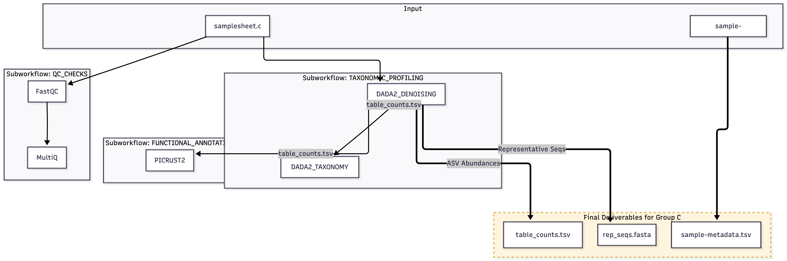

# Group B — alphaflow pipeline

Group B is responsible for **Taxonomic & Functional Analysis** of 16S amplicon sequencing data.
The pipeline takes raw FASTQ reads from Group A and produces:
- A quality control report
- An ASV abundance table with taxonomy
- Predicted functional pathways (PICRUSt2)

---

## Our Mermaid flowchart :)



## Project folder structure

DO NOT PANIC, THIS DISTRIBUTION IS TEMPRARY UNTIL WE HAVE THE WHOLE PIPELINE COMPLETE AND THEN ADAPT IT TO THE DESIRED MAIN BARNCH DISTRIBTION !!!!

```
Group_B/
├── main.nf                        # Full pipeline entry point (all groups combined)
├── test_groupB.nf                 # Standalone test entry point for Group B only
├── nextflow.config                # Cluster resources, container settings, outdir
├── nextflow_schema.json           # Parameter validation schema
├── modules.json                   # nf-core module tracking file
├── run.sh                         # Nextflow launch script
├── run.sbatch                     # SLURM submission wrapper
├── README_Group_B.md              # This file
│
├── workflows/
│   └── groupB.nf                  # Group B workflow definition (all steps chained)
│
├── modules/
│   ├── local/
│   │   ├── dada2/
│   │   │   ├── dada2_denoising.nf # DADA2 denoising, merging, seqtab construction
│   │   │   ├── dada2_export.nf    # Converts seqtab RDS → FASTA + TSV for PICRUSt2
│   │   │   └── dada2_taxonomy.nf  # Assigns taxonomy via SILVA (assignTaxonomy)
│   │   └── picrust.nf             # PICRUSt2 functional annotation
│   └── nf-core/
│       ├── fastqc/main.nf         # Read quality control
│       ├── multiqc/main.nf        # Aggregated QC report
│       ├── kraken2/kraken2/main.nf# k-mer taxonomic classifier (optional)
│       └── dada2/
│           ├── filtandtrim/main.nf # Quality filtering and read trimming
│           └── learnerrors/main.nf # DADA2 error model learning
│
├── conf/
│   ├── base.config                # Default CPU/memory resource labels
│   ├── modules.config             # Per-process publishDir and ext.args settings
│   ├── test.config                # Test profile configuration
│   └── test_full.config           # Full-data test profile
│
├── assets/
│   ├── samplesheet_test.csv       # Test samplesheet (single sample)
│   ├── test_R3.fastq.gz           # Real 16S test reads (~152 bp, single-end)
│   ├── multiqc_config.yml         # MultiQC configuration
│   └── multiqc_logo.png           # MultiQC logo
│
├── biodb/
│   └── dada2/
│       ├── silva_nr99_v138.2_toGenus_trainset.fa   # SILVA genus-level classifier
│       └── silva_v138.2_assignSpecies.fa            # SILVA species-level classifier
│
├── docs/                          # Pipeline documentation
└── work/                          # Nextflow intermediate files (auto-generated)
```

---

## Results folder structure

---------------IMPORTANT FOR OTHER GROUPS THAT DEPEND ON GROUPB-------------

When the pipeline runs, outputs are published to `results_test/` (or whichever `--outdir` is set):

```
results_test/
├── fastqc/                        # Step 1 — Raw read quality control
│   ├── test_sample_fastqc.html    # Visual QC report (open in browser)
│   └── test_sample_fastqc.zip    # Raw QC data
│
├── multiqc/                       # Step 1 — Aggregated QC summary
│   ├── multiqc_report.html        # Single HTML report combining all FastQC results
│   └── multiqc_data/              # Raw data tables used to build the report
│       ├── multiqc_fastqc.txt
│       ├── multiqc_general_stats.txt
│       └── ...
│
├── dada2/                         # Steps 2–4 — All DADA2 outputs (multiple sub-steps)
│   │
│   │  -- Filtering & Trimming (DADA2_FILTNTRIM) --
│   ├── test_sample.filt.fastq.gz       # Filtered reads (single-end)
│   ├── test_sample.filter_stats.tsv    # How many reads passed filtering
│   ├── filterAndTrim.args.txt          # Parameters used for this step
│   │
│   │  -- Error Learning (DADA2_ERR) --
│   ├── prefix.err.rds                  # Error model (R binary, input to denoising)
│   ├── prefix.err.convergence.txt      # Convergence log
│   ├── prefix.err.pdf / .svg           # Error rate plots (for QC)
│   ├── prefix.err.log                  # Verbose learning log
│   ├── learnErrors.args.txt            # Parameters used
│   │
│   │  -- Denoising (DADA2_DENOISING) --
│   ├── prefix.dada.rds                 # Denoised reads object (R binary)
│   ├── prefix.mergers.rds              # Merged pairs object (R binary)
│   ├── prefix.seqtab.rds              # ASV abundance table (R binary) ← KEY OUTPUT
│   ├── prefix.dada.log                 # Denoising log
│   ├── dada.args.txt / mergePairs.args.txt
│   │
│   │  -- Taxonomy Assignment (DADA2_TAXONOMY) --
│   ├── ASV_taxonomy.tsv               # Taxonomy table ← KEY OUTPUT
│   │                                  # Columns: ASV_ID, Kingdom, Phylum, Class,
│   │                                  #          Order, Family, Genus, Species, confidence
│   ├── ASV_tax.rds                    # Taxonomy object in R binary format
│   ├── assignTaxonomy.args.txt        # Parameters used
│   │
│   │  -- Export for PICRUSt2 (DADA2_EXPORT) --
│   ├── rep_seqs.fasta                 # Representative ASV sequences ← KEY OUTPUT
│   └── asv_table.tsv                  # ASV abundance table in plain text ← KEY OUTPUT
│                                      # Format: #OTU ID | sample1 | sample2 | ...
│
├── picrust/                       # Step 5 — Functional annotation
│   ├── EC_metagenome_out/         # Predicted enzyme (EC number) abundances per sample
│   ├── KO_metagenome_out/         # Predicted KEGG Ortholog abundances per sample
│   └── pathways_out/              # Predicted MetaCyc pathway abundances ← KEY OUTPUT
│       ├── path_abun_unstrat.tsv  # Pathway abundance per sample (unstratified)
│       └── path_abun_strat.tsv    # Pathway abundance per taxon per sample (stratified)
│
└── pipeline_info/                 # Nextflow execution metadata
    ├── execution_report_*.html    # Resource usage, timing per process
    ├── execution_timeline_*.html  # Visual timeline of the run
    └── execution_trace_*.txt      # Raw process stats (CPU, RAM, duration)
```

---

## What each tool does

### FastQC
Checks the quality of raw sequencing reads. Reports per-base quality scores, adapter contamination, GC content, and read length distribution. Used to decide truncation thresholds before DADA2 filtering.

### MultiQC
Aggregates all FastQC reports into a single HTML summary. Useful when comparing quality across multiple samples at once.

### DADA2 — filterAndTrim
Removes low-quality bases and trims reads to a fixed length. For single-end 16S reads, we trim to 140 bp (set in `groupB.nf`). Reads that are too short or too low quality after trimming are discarded.

### DADA2 — learnErrors
Learns the sequencing error model from the filtered reads. DADA2 uses this model to distinguish real biological variation (true ASVs) from sequencing errors during denoising.

### DADA2 — denoising (dada2_denoising.nf)
The core DADA2 step. Runs `dada()` to correct errors, `mergePairs()` to join paired-end reads (or skips for single-end), and `makeSequenceTable()` to produce the final ASV abundance matrix. Each unique exact sequence is an ASV.

### DADA2 — taxonomy (dada2_taxonomy.nf)
Assigns taxonomy to each ASV using `assignTaxonomy()` against the SILVA v138.2 reference database. Outputs a TSV with Kingdom through Species and a confidence score for each classification.

### DADA2 — export (dada2_export.nf)
Converts the seqtab RDS (R binary format) into plain-text formats that PICRUSt2 can read: a FASTA file of representative sequences and a TSV abundance table.

### PICRUSt2
Predicts the functional potential of the microbial community by placing ASV sequences into a reference phylogenetic tree and inferring gene content from known genomes of close relatives. Outputs predicted abundances of metabolic pathways (MetaCyc), enzymes (EC), and KEGG orthologs (KO).

---

## Key outputs for Group C

These are the files Group C needs for downstream diversity and differential abundance analysis:

| File | Location | Description |
|------|----------|-------------|
| `ASV_taxonomy.tsv` | `results_test/dada2/` | Taxonomy classification of each ASV |
| `asv_table.tsv` | `results_test/dada2/` | ASV abundance table (plain text) |
| `rep_seqs.fasta` | `results_test/dada2/` | Representative sequences of each ASV |
| `path_abun_unstrat.tsv` | `results_test/picrust/pathways_out/` | Predicted MetaCyc pathway abundances |

---

## How to run

**Test run (single sample, on cluster):**
```bash
sbatch run.sbatch
```

The test samplesheet is `assets/samplesheet_test.csv` and test reads are `assets/test_R3.fastq.gz`.
Output goes to `results_test/` (set via `--outdir results_test` in `run.sh`).

**Resume after failure** (uses Nextflow cache, skips already-completed steps):
```bash
# Add -resume to the nextflow command in run.sh
nextflow run test_groupB.nf -resume ...
```

---

## Pipeline flow

```
Raw FASTQ reads (from Group A)
        │
        ▼
   [FastQC] ──────────────────────────────► fastqc/ + multiqc/
        │
        ▼
   [DADA2 filterAndTrim]
        │
        ▼
   [DADA2 learnErrors]
        │
        ▼
   [DADA2 denoising]  ──────────────────► prefix.seqtab.rds
        │                                         │
        ▼                                         ▼
   [DADA2 taxonomy]                       [DADA2 export]
        │                                    │          │
        ▼                                    ▼          ▼
  ASV_taxonomy.tsv                    rep_seqs.fasta  asv_table.tsv
                                              │          │
                                              └────┬─────┘
                                                   ▼
                                              [PICRUSt2]
                                                   │
                                                   ▼
                                           pathways_out/ (MetaCyc)
```
