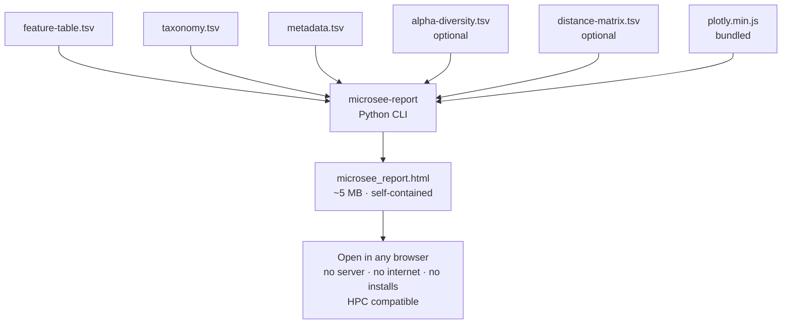

# agb2026

[](https://github.com/agb2026/agb2026/actions/workflows/test.yml)

```bash
pip install -e "modules/groupD/microsee_report"
microsee-report --feature-table feature-table.tsv --taxonomy taxonomy.tsv \
    --metadata metadata.tsv --alpha alpha-diversity.tsv --output report.html
```

---

Repository for the AGB 2026 common class project.  
**Paper:** [Short-Term Ingestion of Essential Amino Acid Based Nutritional Supplements or Whey Protein Improves the Physical Function of Older Adults Independently of Gut Microbiome](https://pubmed.ncbi.nlm.nih.gov/38426663/)

---

## What is MicroSee?

**MicroSee** is Group D's visualisation contribution: a **self-contained HTML report generator**
(`modules/groupD/microsee_report/`). It takes QIIME2 TSV exports and produces a single HTML file
(~5 MB) with 34+ interactive Plotly charts — Plotly.js bundled inside. Open in any browser with
no server, no internet, and no installs (HPC-safe).



---

## Repository layout

```
agb2026/
├── conf/                           ← Nextflow config (base, test, hpc_slurm)
├── modules/groupD/
│   ├── README.md                   ← Full module documentation
│   ├── docs/groupD_inputs.md       ← Upstream QIIME2 → parameter mapping
│   └── microsee_report/            ← Report generator (deliverable)
├── workflows/groupD.nf             ← Nextflow entry point
└── nextflow.config                 ← Profiles: conda, slurm, docker, test, …
```

---

## Quick start — Python

```bash
pip install -e "modules/groupD/microsee_report"

microsee-report \
    --feature-table modules/groupD/microsee_report/tests/data/feature-table.tsv \
    --taxonomy      modules/groupD/microsee_report/tests/data/taxonomy.tsv \
    --metadata      modules/groupD/microsee_report/tests/data/metadata.tsv \
    --alpha         modules/groupD/microsee_report/tests/data/alpha-diversity.tsv \
    --output        microsee_report.html

open microsee_report.html    # macOS
```

---

## Quick start — Nextflow

```bash
# Smoke test with bundled fixtures (recommended first run)
nextflow run workflows/groupD.nf -profile test,conda

# Your data (conda profile — default until container image is on GHCR)
nextflow run workflows/groupD.nf -profile conda \
    --feature_table /path/to/feature-table.tsv \
    --taxonomy      /path/to/taxonomy.tsv \
    --metadata      /path/to/metadata.tsv \
    --alpha         /path/to/alpha-diversity.tsv \
    --outdir        results/
```

SLURM: copy [`conf/hpc_slurm.config`](conf/hpc_slurm.config), edit queue/account, then  
`nextflow run workflows/groupD.nf -profile slurm,conda -c conf/hpc_slurm.config …`

---

## Development

```bash
pip install -e "modules/groupD/microsee_report[dev]"

# Fast unit tests (default)
pytest modules/groupD/microsee_report/tests/ -v

# Slow CLI / HTML integration tests
pytest modules/groupD/microsee_report/tests/ -v -m integration

ruff check modules/groupD/microsee_report/report_generator/
mypy modules/groupD/microsee_report/report_generator/
```

---

## Reproducibility

Runtime pins (pip / conda / Docker): **pandas 2.3.3**, **numpy 2.4.1**, **pydantic 2.13.4**
— see [`pyproject.toml`](modules/groupD/microsee_report/pyproject.toml).

```bash
docker build -t ghcr.io/agb2026/microsee-report:latest \
    modules/groupD/microsee_report/report_generator/
```

`plotly.min.js` (~4.3 MB) must stay in git for offline HPC — see
[`modules/groupD/README.md`](modules/groupD/README.md) troubleshooting.

---

## CI

[`test.yml`](.github/workflows/test.yml): ruff · mypy · pytest (3.10–3.12) · CLI integration · Nextflow smoke  
[`docker-report.yml`](.github/workflows/docker-report.yml): build/push `ghcr.io/agb2026/microsee-report:latest` on `main`

---

## Documentation

- [`modules/groupD/README.md`](modules/groupD/README.md) — charts, HPC, troubleshooting  
- [`modules/groupD/docs/groupD_inputs.md`](modules/groupD/docs/groupD_inputs.md) — input file contract
