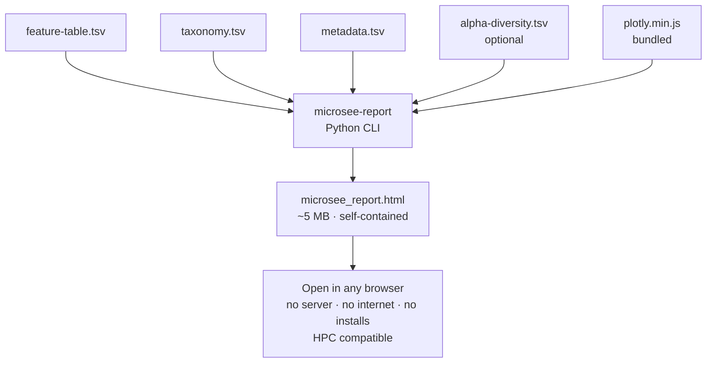

# agb2026

Repository for the AGB 2026 common class project.

**Paper:** [Short-Term Ingestion of Essential Amino Acid Based Nutritional Supplements or Whey Protein Improves the Physical Function of Older Adults Independently of Gut Microbiome](https://pubmed.ncbi.nlm.nih.gov/38426663/)

---

## What is MicroSee?

**MicroSee** is Group D's visualisation contribution to this project. The original goal was a **web app** (Flask backend + React frontend, lives in `microsee/`) that would let users upload QIIME2 data and explore an interactive microbiome dashboard in their browser. `MicroSee.html` is the standalone HTML prototype built to validate that concept.

The final deliverable evolves this idea further: instead of requiring a running server, the report generator in `modules/groupD/microsee_report/` produces a **single self-contained HTML file** with all 30+ charts embedded — including Plotly.js (4.3 MB) bundled directly inside. You open it in any browser, on any machine, with no server, no internet, and no installs. This makes it fully compatible with HPC environments where persistent servers and outbound internet are not available.



The web app and the standalone generator share the same visual language and chart set — the generator is the web app's output crystallised into a portable file.

---

## Repository layout

```
agb2026/
│
├── MicroSee.html                   ← Original standalone HTML prototype (proof of concept)
│
├── microsee/                       ← MicroSee web app (original goal)
│   ├── microsee_backend/           ← Flask/Python API backend
│   │   └── tests/data/             ← QIIME2 TSV test datasets (shared with report generator)
│   └── microsee_frontend/          ← React/TypeScript frontend
│
├── modules/
│   └── groupD/
│       ├── README.md               ← Group D module documentation
│       └── microsee_report/        ← Self-contained HTML report generator (final deliverable)
│           ├── pyproject.toml      ← Python package definition
│           ├── main.nf             ← Nextflow process (MICROSEE_REPORT)
│           ├── tests/              ← pytest unit + smoke tests
│           └── report_generator/   ← Python report engine
│               ├── generate_report.py
│               ├── parsers.py
│               ├── models.py
│               └── charts/         ← Chart builders + HTML template + bundled Plotly.js
│
├── workflows/
│   └── groupD.nf                   ← Nextflow workflow entry point for Group D
│
└── nextflow.config                 ← Cluster profiles (conda, SLURM, SGE, Docker, Singularity)
```

---

## Quick start — generate a report

```bash
# Install the report generator
pip install -e "modules/groupD/microsee_report"

# Run with the bundled test data
microsee-report \
    --feature-table microsee/microsee_backend/tests/data/feature-table.tsv \
    --taxonomy      microsee/microsee_backend/tests/data/taxonomy.tsv \
    --metadata      microsee/microsee_backend/tests/data/metadata.tsv \
    --alpha         microsee/microsee_backend/tests/data/alpha-diversity.tsv \
    --output        microsee_report.html

open microsee_report.html   # macOS; use xdg-open on Linux
```

See [`modules/groupD/README.md`](modules/groupD/README.md) for full documentation including Nextflow / HPC usage, all charts, and test instructions.
