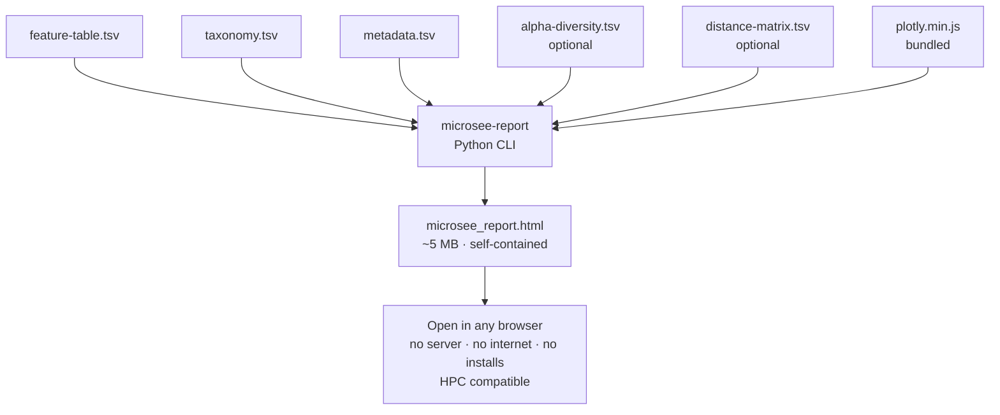
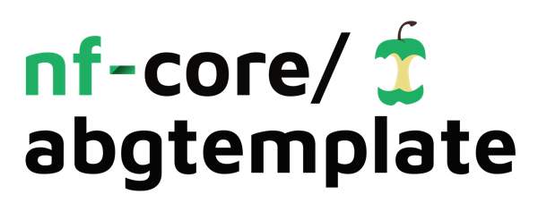

<<<<<<< HEAD
# agb2026

[](https://github.com/egenomics/agb2026/actions/workflows/test.yml)

```bash
pip install -e "modules/groupD/microsee_report"
microsee-report --feature-table feature-table.tsv --taxonomy taxonomy.tsv \
    --metadata metadata.tsv --alpha alpha-diversity.tsv --output report.html
```

---

Repository for the AGB 2026 common class project.  
**Paper:** [Short-Term Ingestion of Essential Amino Acid Based Nutritional Supplements or Whey Protein Improves the Physical Function of Older Adults Independently of Gut Microbiome](https://pubmed.ncbi.nlm.nih.gov/38426663/)

---

## What is MicroSee?

**MicroSee** is Group D's visualisation contribution: a **self-contained HTML report generator**
(`modules/groupD/microsee_report/`). It takes QIIME2 TSV exports and produces a single HTML file
(~5 MB) with 34+ interactive Plotly charts — Plotly.js bundled inside. Open in any browser with
no server, no internet, and no installs (HPC-safe).


```mermaid
flowchart TD
    FT[feature-table.tsv]            --> R[microsee-report\nPython CLI]
    TX[taxonomy.tsv]                  --> R
    MD[metadata.tsv]                  --> R
    AL[alpha-diversity.tsv\noptional] --> R
    DM[distance-matrix.tsv\noptional] --> R
    PJ[plotly.min.js\nbundled]        --> R
    R --> HTML[microsee_report.html\n~5 MB · self-contained]
    HTML --> USER[Open in any browser\nno server · no internet · no installs\nHPC compatible]
```

---

## Repository layout

```
agb2026/
├── conf/                           ← Nextflow config (base, test, hpc_slurm)
├── modules/groupD/
│   ├── README.md                   ← Full module documentation
│   ├── docs/groupD_inputs.md       ← Upstream QIIME2 → parameter mapping
│   └── microsee_report/            ← Report generator (deliverable)
├── workflows/groupD.nf             ← Nextflow entry point
└── nextflow.config                 ← Profiles: conda, slurm, docker, test, …
```

---

## Quick start — Python

```bash
pip install -e "modules/groupD/microsee_report"

microsee-report \
    --feature-table modules/groupD/microsee_report/tests/data/feature-table.tsv \
    --taxonomy      modules/groupD/microsee_report/tests/data/taxonomy.tsv \
    --metadata      modules/groupD/microsee_report/tests/data/metadata.tsv \
    --alpha         modules/groupD/microsee_report/tests/data/alpha-diversity.tsv \
    --output        microsee_report.html

open microsee_report.html    # macOS
```

---

## Quick start — Nextflow

```bash
# Smoke test with bundled fixtures (recommended first run)
nextflow run workflows/groupD.nf -profile test,conda

# Your data (conda profile — default until container image is on GHCR)
nextflow run workflows/groupD.nf -profile conda \
    --feature_table /path/to/feature-table.tsv \
    --taxonomy      /path/to/taxonomy.tsv \
    --metadata      /path/to/metadata.tsv \
    --alpha         /path/to/alpha-diversity.tsv \
    --outdir        results/
```

SLURM: copy [`conf/hpc_slurm.config`](conf/hpc_slurm.config), edit queue/account, then  
`nextflow run workflows/groupD.nf -profile slurm,conda -c conf/hpc_slurm.config …`

---

## Development

```bash
pip install -e "modules/groupD/microsee_report[dev]"

# Fast unit tests (default)
pytest modules/groupD/microsee_report/tests/ -v

# Slow CLI / HTML integration tests
pytest modules/groupD/microsee_report/tests/ -v -m integration

ruff check modules/groupD/microsee_report/report_generator/
mypy modules/groupD/microsee_report/report_generator/
```

---

## Reproducibility

Runtime pins (pip / conda / Docker): **pandas 2.3.3**, **numpy 2.4.1**, **pydantic 2.13.4**
— see [`pyproject.toml`](modules/groupD/microsee_report/pyproject.toml).

```bash
docker build -t ghcr.io/egenomics/microsee-report:latest \
    modules/groupD/microsee_report/report_generator/
```

`plotly.min.js` (~4.3 MB) must stay in git for offline HPC — see
[`modules/groupD/README.md`](modules/groupD/README.md) troubleshooting.

---

## CI

[`test.yml`](.github/workflows/test.yml): ruff · mypy · pytest (3.11–3.12) · CLI integration · Nextflow smoke  
[`docker-report.yml`](.github/workflows/docker-report.yml): build/push `ghcr.io/egenomics/microsee-report:latest` on `main`

---

## Documentation

- [`modules/groupD/README.md`](modules/groupD/README.md) — charts, HPC, troubleshooting  
- [`modules/groupD/docs/groupD_inputs.md`](modules/groupD/docs/groupD_inputs.md) — input file contract
=======
<h1>
  <picture>
    <source media="(prefers-color-scheme: dark)" srcset="docs/images/nf-core-abgtemplate_logo_dark.png">
    
  </picture>
</h1>

[](https://github.com/codespaces/new/nf-core/abgtemplate)
[](https://github.com/nf-core/abgtemplate/actions/workflows/nf-test.yml)
[](https://github.com/nf-core/abgtemplate/actions/workflows/linting.yml)[](https://nf-co.re/abgtemplate/results)[](https://doi.org/10.5281/zenodo.XXXXXXX)
[](https://www.nf-test.com)

[](https://www.nextflow.io/)
[](https://github.com/nf-core/tools/releases/tag/3.5.2)
[](https://docs.conda.io/en/latest/)
[](https://www.docker.com/)
[](https://sylabs.io/docs/)
[](https://cloud.seqera.io/launch?pipeline=https://github.com/nf-core/abgtemplate)

[](https://nfcore.slack.com/channels/abgtemplate)[](https://bsky.app/profile/nf-co.re)[](https://mstdn.science/@nf_core)[](https://www.youtube.com/c/nf-core)

## Introduction

**nf-core/abgtemplate** is a bioinformatics pipeline that ...

<!-- TODO nf-core:
   Complete this sentence with a 2-3 sentence summary of what types of data the pipeline ingests, a brief overview of the
   major pipeline sections and the types of output it produces. You're giving an overview to someone new
   to nf-core here, in 15-20 seconds. For an example, see https://github.com/nf-core/rnaseq/blob/master/README.md#introduction
-->

<!-- TODO nf-core: Include a figure that guides the user through the major workflow steps. Many nf-core
     workflows use the "tube map" design for that. See https://nf-co.re/docs/guidelines/graphic_design/workflow_diagrams#examples for examples.   -->
<!-- TODO nf-core: Fill in short bullet-pointed list of the default steps in the pipeline -->1. Read QC ([`FastQC`](https://www.bioinformatics.babraham.ac.uk/projects/fastqc/))2. Present QC for raw reads ([`MultiQC`](http://multiqc.info/))

## Usage

> [!NOTE]
> If you are new to Nextflow and nf-core, please refer to [this page](https://nf-co.re/docs/usage/installation) on how to set-up Nextflow. Make sure to [test your setup](https://nf-co.re/docs/usage/introduction#how-to-run-a-pipeline) with `-profile test` before running the workflow on actual data.

<!-- TODO nf-core: Describe the minimum required steps to execute the pipeline, e.g. how to prepare samplesheets.
     Explain what rows and columns represent. For instance (please edit as appropriate):

First, prepare a samplesheet with your input data that looks as follows:

`samplesheet.csv`:

```csv
sample,fastq_1,fastq_2
CONTROL_REP1,AEG588A1_S1_L002_R1_001.fastq.gz,AEG588A1_S1_L002_R2_001.fastq.gz
```

Each row represents a fastq file (single-end) or a pair of fastq files (paired end).

-->

Now, you can run the pipeline using:

<!-- TODO nf-core: update the following command to include all required parameters for a minimal example -->

```bash
nextflow run nf-core/abgtemplate \
   -profile <docker/singularity/.../institute> \
   --input samplesheet.csv \
   --outdir <OUTDIR>
```

> [!WARNING]
> Please provide pipeline parameters via the CLI or Nextflow `-params-file` option. Custom config files including those provided by the `-c` Nextflow option can be used to provide any configuration _**except for parameters**_; see [docs](https://nf-co.re/docs/usage/getting_started/configuration#custom-configuration-files).

For more details and further functionality, please refer to the [usage documentation](https://nf-co.re/abgtemplate/usage) and the [parameter documentation](https://nf-co.re/abgtemplate/parameters).

## Pipeline output

To see the results of an example test run with a full size dataset refer to the [results](https://nf-co.re/abgtemplate/results) tab on the nf-core website pipeline page.
For more details about the output files and reports, please refer to the
[output documentation](https://nf-co.re/abgtemplate/output).

## Credits

nf-core/abgtemplate was originally written by AGB-UPF2026.

We thank the following people for their extensive assistance in the development of this pipeline:

<!-- TODO nf-core: If applicable, make list of people who have also contributed -->

## Contributions and Support

If you would like to contribute to this pipeline, please see the [contributing guidelines](.github/CONTRIBUTING.md).

For further information or help, don't hesitate to get in touch on the [Slack `#abgtemplate` channel](https://nfcore.slack.com/channels/abgtemplate) (you can join with [this invite](https://nf-co.re/join/slack)).

## Citations

<!-- TODO nf-core: Add citation for pipeline after first release. Uncomment lines below and update Zenodo doi and badge at the top of this file. -->
<!-- If you use nf-core/abgtemplate for your analysis, please cite it using the following doi: [10.5281/zenodo.XXXXXX](https://doi.org/10.5281/zenodo.XXXXXX) -->

<!-- TODO nf-core: Add bibliography of tools and data used in your pipeline -->

An extensive list of references for the tools used by the pipeline can be found in the [`CITATIONS.md`](CITATIONS.md) file.

You can cite the `nf-core` publication as follows:

> **The nf-core framework for community-curated bioinformatics pipelines.**
>
> Philip Ewels, Alexander Peltzer, Sven Fillinger, Harshil Patel, Johannes Alneberg, Andreas Wilm, Maxime Ulysse Garcia, Paolo Di Tommaso & Sven Nahnsen.
>
> _Nat Biotechnol._ 2020 Feb 13. doi: [10.1038/s41587-020-0439-x](https://dx.doi.org/10.1038/s41587-020-0439-x).
>>>>>>> Group_A/main
