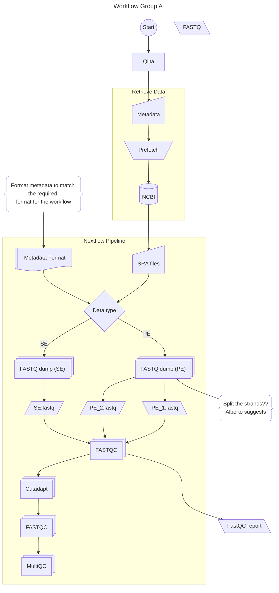

# GROUP A: Data Handling & Preprocessing

This folder contains all modules developed by Group A.

## Group Responsibilities
- Data input and validation
- Quality control
- Preprocessing and normalization
- Metadata integration

## Workflow



## Modules
<!-- Each group member should add their modules here -->

### Module Template
```
module_name/
├── main.nf          # Process definition
├── meta.yml         # Module metadata
└── tests/
    ├── main.nf.test      # Test definition
    └── main.nf.test.snap # Test snapshots
```

## Integration Points
This group outputs data consumed by:
- **Group B** - Receives preprocessed data

## Communication
- Document your outputs clearly
- Update the main workflow integration points
- Test your modules before integration

