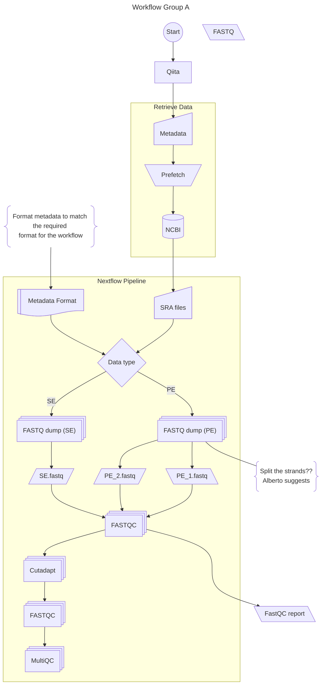

# groupA
# Preprocessing

This folder contains the Nextflow process modules that handle **quality control and adapter trimming** of the raw FASTQ files generated in the previous step. The workflow is defined in `workflows/groupA.nf`

The pipeline runs sequentially in this order:

```
raw FASTQs -> FASTQC (raw) -> CUTADAPT -> FASTQC (trimmed) -> MULTIQC -> CLEAN_MULTIQC -> NEW_SAMPLE_SHEET
```

---

## Workflow


```mermaid
---
title: Workflow Group A
---
flowchart 

%% Sofware / tools = rect
%% Nextflow modules = st-rect
%% Database = cyl
%% Input = sl-rect
%% Output = lean
%% documentation = doc
%% decision = diamond
%% comments = brace
%% Manual input = lean-r


metadata@{shape: sl-rect, label: "Metadata"}
comment@{shape : braces, label: "Format metadata to match the required </br>format for the workflow" }
format@{shape: lin-doc, label: "Metadata Format"}

%%doc@{shape : doc, label: "Documentation"}
%%O@{ shape: lean-l, label: "Preprocessed Data" }
%%I@{ shape: sl-rect, label: "Raw Data" }

A@{ shape: circle, label: "Start" }
type@{ shape: diamond, label: "Data type" }
Qiita@{ shape: rect, label: "Qiita" }
prefetch@{ shape: trap-t, label: "Prefetch" }
NCBI@{ shape: cyl, label: "NCBI" }
fastq@{ shape: sl-rect, label: "SRA files" }
split@{ shape: st-rect, label: "FASTQ dump (PE)"}
split2@{ shape: st-rect, label: "FASTQ dump (SE)"}
se@{ shape: lean-r, label: "SE.fastq"}
qreport@{shape: lean-l, label: "FastQC report"}

pe_1@{shape: lean-l, label: "PE_1.fastq"}
pe_2@{shape: lean-r, label: "PE_2.fastq"}
FASTQC@{shape: st-rect, label: "FASTQC"}
CUTADAPT@{shape: st-rect, label: "Cutadapt"}
FASTQC2@{shape: st-rect, label: "FASTQC"}
MultiQC@{shape: st-rect, label: "MultiQC"}
trimmed@{shape: lean-l, label: "FASTQ"}


%% Diagram

A --> Qiita --> metadata


subgraph NC [ Retrieve Data ]
    direction LR
    metadata --> prefetch --> NCBI
end

NCBI --> fastq
comment --> format

subgraph Nextflow ["Nextflow Pipeline"]
    direction TB

    fastq & format --> type
    type -->|PE| split --> pe_1 & pe_2 --> FASTQC
    type -->|SE| split2 --> se --> FASTQC
    FASTQC --> CUTADAPT --> FASTQC2
    FASTQC2 --> MultiQC


end

split --- comment1@{shape: braces, label: "Split the strands?? <br> Alberto suggests" }
FASTQC ---> qreport


```

## Modules

| File | Process | Tool | Version | Container |
|------|---------|------|---------|-----------|
| `a_fastqc.nf` | `FASTQC` | FastQC | 0.12.1 | fastqc_0.12.1.sif |
| `a_cutadapt.nf` | `CUTADAPT` | Cutadapt | 4.6 | cutadapt_4.6.sif |
| `a_multiqc.nf` | `MULTIQC` | MultiQC | 1.19 | multiqc_1.19.sif |
| `a_clean_multiqc.nf` | `CLEAN_MULTIQC` | pandas | 1.5.2 | pandas_2.0.3.sif |
| `a_new_sample_sheet.nf` | `NEW_SAMPLE_SHEET` | pandas | 1.5.2 | pandas_2.0.3.sif |

Containers are pulled automatically at runtime from the [Galaxy Project Singularity depot](https://depot.galaxyproject.org/singularity/) or from `quay.io/biocontainers`. Local `.sif` fallback images are listed in each module as comments.

---

## Module details

#### Input validation

Before any process runs, each sample in the input chanel is checked if they exists and is non-empty. Samples that fail either check are skipped with a warning and logged to `<outdir>/groupA/errors/skipped_samples_log.tsv` with columns `Sample_ID`, `Error_Type` and `Expected_Path`. 

### 1. FASTQC - raw data (`a_fastqc.nf`)

Runs FastQC on the raw FASTQ files to establish a quality baseline before trimming.

**Input channel:** `tuple val(sample_id), val(stage), path(reads)`

**Output channel:** `qc_files` - tuple with `sample_id`, `stage`, and all `*_fastqc.html` / `*_fastqc.zip` files.

The `stage` value tags each run as `raw` or `trimmed` so both FastQC passes can be distinguished downstream in MultiQC.

---

### 2. CUTADAPT (`a_cutadapt.nf`)

Trims the forward primer from the raw reads. Only single-end mode is used (reads `reads[0]`).

**Input channel:** `tuple val(sample_id), path(reads)`

**Output channel:** `trimmed_reads` - tuple with `sample_id` and `${sample_id}_trim.fastq.gz`.

**Pipeline parameter used:**

| Parameter | Description |
|-----------|-------------|
| `params.fwd_primer` | Forward primer sequence passed to the `-g` flag of Cutadapt |

> The log files (adapter statistics) are not explicitly emitted by this process but are captured by Nextflow's stdout and available in the work directory for inspection.

---

### 3. FASTQC - trimmed data (`a_fastqc.nf`)

The same `FASTQC` module is called a second time on the trimmed FASTQ files, with `stage = "trimmed"`. This allows the trimming effect to be compared against the raw baseline in the MultiQC report.

---

### 4. MULTIQC (`a_multiqc.nf`)

Aggregates all FastQC reports (raw and trimmed) into a single report. The process receives all `.html` and `.zip` files collected from both FastQC runs and runs `multiqc .` in the working directory.

**Input:** `path qc_files` - all FastQC output files collected into a single directory.

**Output channels:**

| Channel | File | Description |
|---------|------|-------------|
| `report` | `multiqc_report.html` | Interactive HTML report |
| `data_dir` | `multiqc_data/` | Full MultiQC data directory |
| `fastqc_txt` | `multiqc_data/multiqc_fastqc.txt` | Flat-text FastQC summary table; input for `CLEAN_MULTIQC` |

**Published to:** `${outdir}/groupA/multiqc/` (configured in `conf/modules.config`)

---

### 5. CLEAN_MULTIQC (`a_clean_multiqc.nf`)

Parses `multiqc_fastqc.txt` using the `bin/groupA/clean_multiqc.py` script and applies quality thresholds specific to 16S rRNA V4 amplicon data. Samples that do not meet all four criteria are excluded from the output.

**Input:** `path multiqc_fastqc_txt` - the `multiqc_fastqc.txt` file emitted by `MULTIQC`.

**Output channel:** `final_report` - `quality_report_A.tsv`, a structured TSV with one row per sample and the following columns:

| Column | Source field in `multiqc_fastqc.txt` | Description |
|--------|--------------------------------------|-------------|
| `sample-id` | `Sample` | SRA run accession |
| `length` | `avg_sequence_length` | Average read length in bp |
| `length_interp` | derived | `pass` (120–320 bp) / `few` (<120) / `more` (>320) |
| `deduplicated` | `total_deduplicated_percentage` | % of reads remaining after deduplication |
| `deduplicated_interp` | derived | `pass` (80–95%) / `few` (<80%) / `more` (>95%) |
| `%GC` | `%GC` | GC content percentage |
| `gc_interp` | derived | `pass` (40–60%) / `few` (<40%) / `more` (>60%) |
| `quality_score_status` | `per_sequence_quality_scores` | FastQC per-sequence quality score status |
| `quality_interp` | derived | `pass` / `fail` |


**Published to:** `${outdir}/groupA/clean/` (configured in `conf/modules.config`)

---

### 6. NEW_SAMPLE_SHEET (`a_new_sample_sheet.nf`)

Calls `bin/groupA/generate_sample_sheet_B.py` with the list of sample IDs that passed quality filtering and generate a CSV file mapping each sample ID to the trimmed FASTQ directory, intended as a file-based handoff to Group B.

**Input:** `path id_list` - a text file with one valid `sample_id` per line (derived from `quality_report_A.tsv`).

**Output channel:** `final_sheet` - `sample_sheet_B.csv`, a CSV mapping each `sample_id` to its trimmed FASTQ path under `${params.outdir}/seqs/trimmed/`.

**Pipeline parameters used:**

| Column | Content |
|--------|---------|
| `sample_id` | SRA run accession |
| `directory` | Path to the trimmed FASTQ directory (`${params.outdir}/seqs/trimmed`), same for all samples |

---

## Output directory structure

```
{out_dir}/
├── quality/
│   ├── original_multiqc/            # MultiQC report on raw reads only (pre-trim)
│   │   ├── multiqc_report.html
│   │   └── multiqc_data/
│   │       ├── multiqc_fastqc.txt
│   │       ├── multiqc_general_stats.txt
│   │       ├── multiqc_data.json
│   │       ├── multiqc_citations.txt
│   │       ├── multiqc_software_versions.txt
│   │       ├── multiqc_sources.txt
│   │       └── multiqc.log
│   ├── original_multiqc.zip         # Compressed copy of the original MultiQC report
│   ├── merged/                      # MultiQC report with pre- and post-trim together
│   │   ├── multiqc_report.html      # Compare quality before and after trimming
│   │   └── multiqc_data/
│   │       ├── multiqc_fastqc.txt
│   │       ├── multiqc_general_stats.txt
│   │       ├── multiqc_data.json
│   │       ├── multiqc_citations.txt
│   │       ├── multiqc_software_versions.txt
│   │       ├── multiqc_sources.txt
│   │       └── multiqc.log
│   ├── quality_report_A.tsv         # Cleaned FastQC summary table (from CLEAN_MULTIQC)
│   └── skipped_samples_log.tsv      # Samples excluded due to QC failure, with reasons
└── seqs/
    └── trimmed/
        └── {sample_id}_trim.fastq   # Adapter-trimmed reads (one file per sample)
```

`sample_sheet_B.csv` is written to the Nextflow work directory and published according to `conf/modules.config`.

---

## Helper scripts

Two Python scripts called by the Nextflow processes live under `bin/groupA/`:

| Script | Called by | Description |
|--------|-----------|-------------|
| `clean_multiqc.py` | `CLEAN_MULTIQC` | Parses `multiqc_fastqc.txt` and applies quality thresholds |
| `generate_sample_sheet_B.py` | `NEW_SAMPLE_SHEET` | Builds `sample_sheet_B.csv` from the passing sample IDs |
