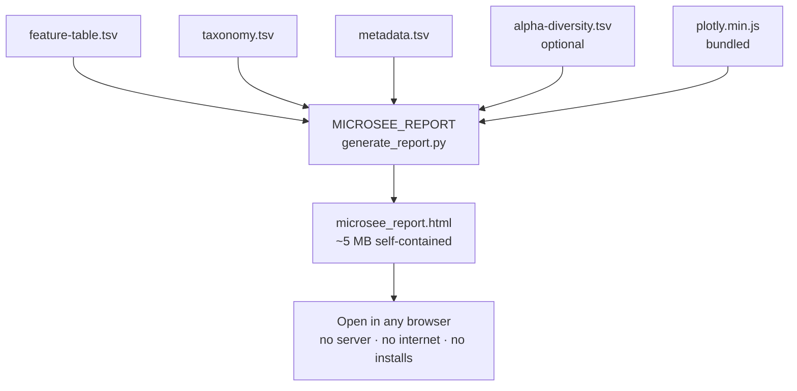

# Group D — Visualisation Module (MicroSee Report Generator)

## What this module does

Takes QIIME2 TSV exports from upstream groups and generates a **single self-contained HTML report** (`microsee_report.html`). The report opens in any browser with no server, no installs, and **no internet required** — Plotly.js (4.3 MB) is embedded directly in the file, making it fully offline-compatible on HPC nodes.

> **Context:** MicroSee started as a web app (`microsee/` at the repo root). This report generator is the evolved, portable form of that idea — the same interactive charts, but crystallised into one file you can email, archive, or open anywhere.

---

## Module layout

```
modules/groupD/
├── README.md
└── microsee_report/
    ├── pyproject.toml              ← Python package (pip install -e .)
    ├── main.nf                     ← Nextflow process (MICROSEE_REPORT)
    ├── tests/
    │   ├── test_parsers.py         ← Unit tests for all parsers + integrate()
    │   └── test_charts.py          ← Smoke tests for chart builders + HTML rendering
    └── report_generator/           ← Python report engine
        ├── __init__.py
        ├── generate_report.py      ← CLI entry point  (microsee-report command)
        ├── parsers.py              ← QIIME2 TSV parsers
        ├── models.py               ← Pydantic v2 data models
        ├── requirements.txt        ← Pinned dependencies (for reference)
        ├── Dockerfile              ← Container image definition
        └── charts/
            ├── config.py           ← Colour palette and Plotly layout defaults
            ├── utils.py            ← Shared colour helpers (group + taxon palette)
            ├── distances.py        ← Bray-Curtis, Jaccard, PCoA, clustering
            ├── taxonomy.py         ← Stacked bar (27 filter combos), donut, sunburst
            ├── alpha.py            ← Strip/box/violin, brackets, rarefaction, multi-metric
            ├── beta.py             ← PCoA, NMDS, dendrogram, Δ abundance heatmap
            ├── individual.py       ← Slopegraph, stability, rank plot, radar, small multiples
            ├── comparative.py      ← LFC bar, volcano, ANCOM-style CLR, heatmap, correlation
            ├── clinical.py         ← Clinical slopegraphs, Shannon scatter, taxa×clinical heatmap
            ├── stats.py            ← Wilcoxon / MW tests, LME trajectory, PERMANOVA, summary table
            ├── renderer.py         ← Aggregates all chart data, fills HTML template
            ├── template.html       ← HTML/CSS/JS report shell (all interactive controls)
            └── plotly.min.js       ← Bundled Plotly.js v2.35.2 (MUST be committed to git)
```

---

## Inputs / Outputs

| Parameter | Description | Required |
|---|---|---|
| `--feature-table` | QIIME2 `feature-table.tsv` export | yes |
| `--taxonomy` | QIIME2 `taxonomy.tsv` export | yes |
| `--metadata` | QIIME2 `metadata.tsv` export | yes |
| `--alpha` | QIIME2 `alpha-diversity.tsv` export | no |
| `--output` | Output HTML path (default: `microsee_report.html`) | no |

**Output:** `microsee_report.html` — a single ~5 MB file, opens in any browser.

---

## Charts included (30+)

| Section | Charts |
|---|---|
| Taxonomy | Stacked bar (27 filter combos: timepoint × group × top-N), top taxa ranking, donut per group, sunburst |
| Alpha Diversity | Strip / box / violin with metric toggle, significance brackets (Wilcoxon + Mann-Whitney), rarefaction curves, multi-metric bar+diamond |
| Beta Diversity | PCoA Bray-Curtis + Jaccard, NMDS, hierarchical dendrogram, Δ abundance heatmap |
| Individual | Paired slopegraph, microbiome stability bar, diversity rank plot, patient radar, NMDS trajectories, small-multiples composition grid |
| Comparative | LFC bar, volcano (BH-FDR), ANCOM-style CLR, abundance heatmap, taxon correlation matrix |
| Clinical *(if sixmwt / il18 in metadata)* | 6MWT + IL-18 slopegraphs, Shannon vs clinical scatter, taxa × clinical Spearman heatmap |
| Longitudinal | Shannon over time, LME-style trajectory (mean ± 95% CI + individual lines, p annotated) |
| Statistics | PERMANOVA (99 perms), diversity summary table (5 metrics, mean ± SD per group) |

---

## Running standalone

```bash
# Install once (from repo root)
pip install -e "modules/groupD/microsee_report"

# Run with your own data
microsee-report \
    --feature-table path/to/feature-table.tsv \
    --taxonomy      path/to/taxonomy.tsv       \
    --metadata      path/to/metadata.tsv       \
    --alpha         path/to/alpha-diversity.tsv \
    --output        microsee_report.html

# Quick test with bundled data
microsee-report \
    --feature-table microsee/microsee_backend/tests/data/feature-table.tsv \
    --taxonomy      microsee/microsee_backend/tests/data/taxonomy.tsv       \
    --metadata      microsee/microsee_backend/tests/data/metadata.tsv       \
    --alpha         microsee/microsee_backend/tests/data/alpha-diversity.tsv \
    --output        /tmp/test_report.html
```

---

## Running via Nextflow

```bash
# With conda (default)
nextflow run workflows/groupD.nf -profile conda \
    --feature_table path/to/feature-table.tsv \
    --taxonomy      path/to/taxonomy.tsv       \
    --metadata      path/to/metadata.tsv       \
    --alpha         path/to/alpha-diversity.tsv \
    --outdir        results/

# On a SLURM cluster
nextflow run workflows/groupD.nf -profile slurm,conda \
    --feature_table ...

# With bundled test data
nextflow run workflows/groupD.nf -profile test,conda
```

---

## Running tests

```bash
# Install with test extras
pip install -e "modules/groupD/microsee_report[dev]"

# Run the full test suite
pytest modules/groupD/microsee_report/tests/ -v
```

Tests cover:
- All four parsers (feature table, taxonomy, metadata, alpha diversity)
- `integrate()` — sample rows, relative abundances summing to 100%
- `compute_chart_data()` — all chart sections present and correctly shaped
- `render_html()` — valid HTML, placeholder replaced, file size > 100 KB

---

## HPC compatibility checklist

- [x] **Offline** — Plotly.js bundled in the HTML; no CDN calls at render time
- [x] **No display required** — pure CLI, no GUI or X11 needed
- [x] **Shared filesystem safe** — reads from staged Nextflow work directory (NFS/Lustre compatible)
- [x] **Pure Python stats** — no R, no MATLAB, no scipy required
- [x] **Container support** — Dockerfile provided; use `-profile singularity` or `-profile docker`
- [x] **Conda support** — all deps resolved from defaults/conda-forge, pinned with `<3` caps

---

## One-time setup: bundle Plotly.js

`plotly.min.js` must be committed to the repository so HPC compute nodes (no outbound internet) can find it:

```bash
curl -fsSL https://cdn.plot.ly/plotly-2.35.2.min.js \
     -o modules/groupD/microsee_report/report_generator/charts/plotly.min.js

git add modules/groupD/microsee_report/report_generator/charts/plotly.min.js
git commit -m "Bundle Plotly.js v2.35.2 for offline HPC use"
```

If the file is missing at runtime, the script attempts to auto-download it once with a clear warning.

---

## Input file format reference

All inputs are QIIME2 TSV exports. Comment lines starting with `#` are skipped automatically.

| File | Required columns |
|---|---|
| `feature-table.tsv` | First col = feature/OTU ID; remaining cols = sample IDs with integer read counts |
| `taxonomy.tsv` | `Feature ID`, `Taxon` (semicolon-separated lineage, e.g. `d__Bacteria;p__Firmicutes;...`) |
| `metadata.tsv` | `sample-id`, plus any of: `subject`/`patient`, `group`/`treatment`, `timepoint`/`time` |
| `alpha-diversity.tsv` | `sample-id`, then any of: `shannon_entropy`, `simpson`, `observed_features`, `faith_pd`, `pielou_evenness` |

Column names are matched by regex so minor variations (`shannon` vs `shannon_entropy`) are handled automatically.

---

## Faith PD note

Faith's Phylogenetic Diversity requires a phylogenetic tree and cannot be computed from abundance counts alone. To generate it:

```bash
qiime diversity alpha-phylogenetic \
    --i-phylogeny rooted-tree.qza \
    --i-table feature-table.qza \
    --p-metric faith_pd \
    --o-alpha-diversity faith_pd.qza
qiime tools export --input-path faith_pd.qza --output-path faith_pd_export/
```

Pass `faith_pd_export/alpha-diversity.tsv` as `--alpha`. If the column is absent, its toggle button is greyed out with a tooltip explaining why.

---

## Workflow diagram


