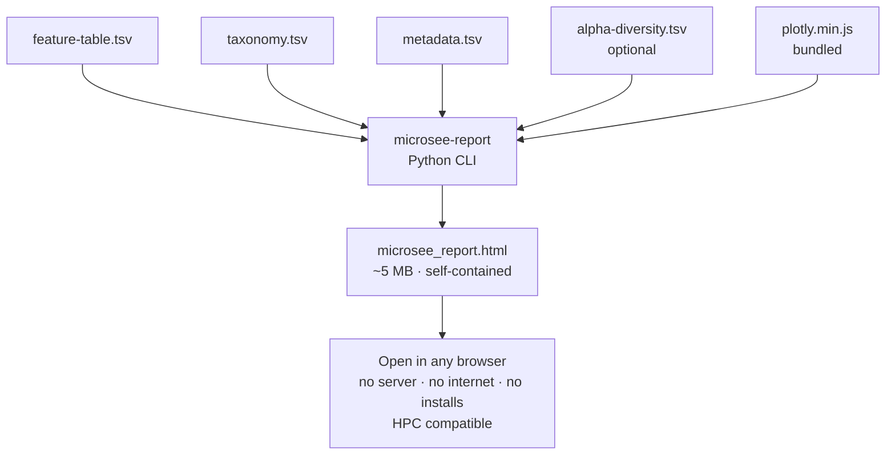

# Group D — Visualisation Module (MicroSee Report Generator)

## What this module does

Takes QIIME2 TSV exports from upstream groups and generates a **single self-contained HTML report** (`microsee_report.html`). The report opens in any browser with no server, no installs, and **no internet required** — Plotly.js (4.3 MB) is embedded directly in the file, making it fully offline-compatible on HPC nodes.

Pipeline input mapping: [`docs/groupD_inputs.md`](docs/groupD_inputs.md).

---

## Module layout

```
modules/groupD/
├── README.md
└── microsee_report/
    ├── pyproject.toml              ← Python package (pip install -e .)
    ├── environment.yml             ← Conda environment definition
    ├── main.nf                     ← Nextflow process (MICROSEE_REPORT)
    ├── tests/
    │   ├── data/                       ← Fixture TSVs (12 patients × 2 timepoints = 24 samples)
    │   │   ├── feature-table.tsv
    │   │   ├── taxonomy.tsv
    │   │   ├── metadata.tsv            ← includes sixmwt + il18 clinical columns
    │   │   └── alpha-diversity.tsv     ← 5 metrics: shannon, simpson, observed, pielou, faith_pd
    │   ├── conftest.py                 ← Shared pytest hooks
    │   ├── test_parsers.py             ← Unit tests for all parsers + integrate()
    │   ├── test_charts.py              ← Smoke tests for chart builders + HTML rendering
    │   ├── test_preprocessing.py       ← Unit tests for row helpers (get_patient_timepoints, …)
    │   ├── test_distances.py           ← Unit tests for Bray-Curtis, Jaccard, PCoA, clustering
    │   ├── test_stats_helpers.py       ← Unit tests for Wilcoxon, MW, Welch t, Spearman, BH-FDR
    │   └── test_cli_integration.py     ← End-to-end CLI smoke tests (marked `integration`)
    └── report_generator/               ← Python report engine
        ├── __init__.py
        ├── py.typed                    ← PEP 561 marker (typed package)
        ├── generate_report.py          ← CLI entry point (microsee-report command)
        ├── parsers.py                  ← QIIME2 TSV parsers
        ├── integrator.py               ← Joins parsed data into SampleRow objects
        ├── models.py                   ← Pydantic v2 data models
        ├── requirements.txt            ← Pinned dependencies (for reference)
        ├── Dockerfile              ← Container image definition
        └── charts/
            ├── config.py            ← Colour palette and Plotly layout defaults
            ├── utils.py             ← Shared colour helpers (group + taxon palette)
            ├── preprocessing.py     ← Shared row helpers (get_patient_timepoints, sorted_timepoints, …)
            ├── metrics.py           ← METRIC_LABELS, metric_value(), pielou_evenness()
            ├── stats_helpers.py     ← Pure stat functions (Wilcoxon, MW, Welch t, Spearman, BH-FDR)
            ├── distances.py         ← Bray-Curtis, Jaccard, PCoA, clustering
            ├── taxonomy.py          ← Stacked bar (27 filter combos), donut, sunburst
            ├── alpha.py             ← Strip/box/violin, brackets, rarefaction, multi-metric
            ├── beta.py              ← PCoA, NMDS, dendrogram, Δ abundance heatmap
            ├── individual.py        ← Slopegraph, stability, rank plot, radar, small multiples
            ├── comparative.py       ← LFC bar, volcano, ANCOM-style CLR, heatmap, correlation
            ├── clinical.py          ← Clinical slopegraphs, Shannon scatter, taxa×clinical heatmap
            ├── stats.py             ← Wilcoxon / MW tests, LME trajectory, PERMANOVA, summary table
            ├── insights.py          ← Dynamic text insights (section banners) generated from chart payloads
            ├── insights_charts.py   ← Per-chart ℹ explanations (what/finding/pills) for every chart panel
            ├── orchestrator.py      ← compute_chart_data() + ReportConfig (section selection)
            ├── renderer.py          ← Fills HTML templates (cohort + per-patient reports)
            ├── template.html        ← HTML/CSS/JS cohort report shell (all interactive controls)
            ├── patient_template.html← Per-patient HTML report shell
            └── plotly.min.js        ← Bundled Plotly.js v2.35.2 (MUST be committed to git)
```

---

## Quickstart (works out of the box)

```bash
# 1. Install once (from repo root)
pip install -e "modules/groupD/microsee_report"

# 2. Generate a report using the bundled fixture data
#    Note: the fixture metadata includes sixmwt and il18 columns, so the
#    Clinical section will appear in this demo — this is the full-featured output.
microsee-report \
    --feature-table modules/groupD/microsee_report/tests/data/feature-table.tsv \
    --taxonomy      modules/groupD/microsee_report/tests/data/taxonomy.tsv \
    --metadata      modules/groupD/microsee_report/tests/data/metadata.tsv \
    --alpha         modules/groupD/microsee_report/tests/data/alpha-diversity.tsv \
    --output        /tmp/microsee_demo.html

# 3. Open in browser
open /tmp/microsee_demo.html          # macOS
xdg-open /tmp/microsee_demo.html      # Linux
```

---

## Usage with your own data

```bash
# --alpha is optional but strongly recommended
microsee-report \
    --feature-table path/to/feature-table.tsv \
    --taxonomy      path/to/taxonomy.tsv \
    --metadata      path/to/metadata.tsv \
    --alpha         path/to/alpha-diversity.tsv \
    [--distance-matrix path/to/distance-matrix.tsv] \
    --output        microsee_report.html

# Generate one HTML per patient (plus the combined report)
microsee-report ... --mode all --output microsee_report.html
# Produces: microsee_report.html + microsee_report_Pat1.html, etc.
```

**`--mode` options:**

| Mode | Output |
|---|---|
| `cohort` (default) | One combined report for all samples |
| `patient` | One HTML per patient |
| `all` | Combined report + one per patient |

---

## What the report shows (for biologists)

### Taxonomy
**What it answers:** Which bacteria are most abundant, and does their composition differ between treatment groups?

- **Stacked bar chart** — shows relative abundance of each bacterial family for every sample. Use the filter buttons to compare T0 vs T84, or one treatment group vs another.
- **Top taxa ranking** — horizontal bar showing which families dominate on average.
- **Donut chart** — average composition per group at a glance.
- **Sunburst** — hierarchical view of group → family → abundance.

### Alpha Diversity
**What it answers:** How rich and even is the microbial community within each person?

- **Strip / Box / Violin charts** — distributions of diversity metrics per group. Toggle between Shannon H′ (information content), Simpson 1−D (dominance), Pielou J′ (evenness), Observed taxa (richness), and Faith PD (phylogenetic diversity).
- **Significance brackets** — automatically computed Wilcoxon (paired, T0→T84) and Mann-Whitney (between groups at T84) p-values drawn directly on the box chart.
- **Rarefaction curves** — shows whether sequencing depth was sufficient to capture community richness.
- **Multi-metric chart** — observed richness (bars) and Pielou J′ evenness (diamonds) side by side.

### Beta Diversity
**What it answers:** How different are the microbial communities between people or between timepoints?

- **PCoA (Bray-Curtis and Jaccard)** — ordination plots where closer dots mean more similar communities. If samples from different groups cluster separately, supplementation may have structured the microbiome.
- **NMDS** — alternative ordination emphasising rank-order distances.
- **Hierarchical dendrogram** — which samples are most similar to each other? Branches that cluster by group or timepoint indicate a treatment effect.
- **Δ Abundance heatmap** — shows which families increased (red) or decreased (blue) between T0 and T84 for each patient. Sorted by the family that changed most.

### Individual Analysis
**What it answers:** How did each patient's microbiome change individually?

- **Paired slopegraph** — one line per patient showing Shannon H′ at T0 and T84. Lines going up = increased diversity.
- **Stability score** — Bray-Curtis dissimilarity for each patient (0 = identical T0 and T84 samples, 1 = completely different). Shorter bars = more stable microbiome.
- **Diversity rank** — all samples ranked from lowest to highest Shannon H′.
- **Patient radar** — per-patient spider/web chart showing T0 vs T84 vs group mean composition. Select any patient from the dropdown; each axis is one bacterial family. The group mean band provides cohort context.
- **NMDS trajectories** — arrows showing where each patient's community moved in ordination space (T0 → T84). Short arrows = stable, long arrows = large shift.
- **Small multiples** — individual stacked bar charts for every patient showing T0 and T84 side by side.

### Comparative
**What it answers:** Which bacterial families significantly changed in abundance?

- **Log fold change bar** — which families increased or decreased the most (T84 vs T0)?
- **Volcano plot** — combines effect size (fold change) with statistical significance (FDR-corrected p-value). Red dots passed both thresholds.
- **ANCOM-style CLR** — compositionally-unbiased differential abundance test (CLR-transformed paired Wilcoxon). More robust than simple fold-change for compositional data.
- **Abundance heatmap** — sample × family matrix, colour = relative abundance.
- **Taxon correlation matrix** — which families tend to co-occur (positive correlation) or compete (negative)?

### Clinical *(only shown if sixmwt / il18 columns are in metadata — the bundled demo data always includes them)*
**What it answers:** Does microbiome diversity correlate with physical function or inflammation?

- **6MWT and IL-18 slopegraphs** — individual patient trajectories for the 6-minute walk test and IL-18 cytokine, with group mean dashed line.
- **Shannon vs 6MWT / IL-18 scatter** — Pearson correlation between diversity and each clinical outcome, with regression line and r/p annotation.
- **Taxa × Clinical Spearman heatmap** — which families correlate with improvement in 6MWT or reduction in IL-18? Stars indicate statistical significance.

### Longitudinal
**What it answers:** How did diversity change over the study period on average?

- **Shannon over time** — group mean per timepoint connected by a line.
- **LME-style trajectory** — mean ± 95% CI band with individual patient lines underneath. Toggle the metric with the Alpha Diversity buttons. Wilcoxon p-value is annotated.

### Statistics
**What it answers:** Do the observed differences pass formal statistical tests?

- **PERMANOVA table** — tests which factor (supplementation group, timepoint, individual) explains the most variance in community composition. R² = fraction of variance explained.
- **Diversity summary table** — mean ± SD of all five alpha metrics per group.

---

## Running via Nextflow

```bash
# With conda (default) — cohort report only
nextflow run workflows/groupD.nf -profile conda \
    --feature_table path/to/feature-table.tsv \
    --taxonomy      path/to/taxonomy.tsv \
    --metadata      path/to/metadata.tsv \
    --alpha         path/to/alpha-diversity.tsv \
    --outdir        results/

# Cohort + one HTML per patient
nextflow run workflows/groupD.nf -profile conda \
    --feature_table path/to/feature-table.tsv \
    --taxonomy      path/to/taxonomy.tsv \
    --metadata      path/to/metadata.tsv \
    --report_mode   all \
    --outdir        results/

# With bundled test fixtures
nextflow run workflows/groupD.nf -profile test,conda

# On a SLURM cluster
nextflow run workflows/groupD.nf -profile slurm,conda \
    --feature_table ...
```

> **Nextflow uses `python3` directly, not the `microsee-report` CLI.** The process stages
> `report_generator/` into the work directory and runs `python3 report_generator/generate_report.py`.
> This is equivalent to the CLI and works without `pip install` in every environment (conda, container,
> bare Python). If you are debugging a failed process, look for `generate_report.py` errors in the
> `.command.err` file inside the Nextflow work directory, not for a missing `microsee-report` binary.

> **Alpha diversity file** — QIIME2 exports one metric per file (e.g. `shannon_entropy.tsv`,
> `faith_pd.tsv`). Merge them into a single TSV before passing to `--alpha`:
> ```bash
> paste shannon_entropy.tsv <(cut -f2- faith_pd.tsv) \
>       <(cut -f2- observed_features.tsv) > alpha-diversity.tsv
> ```
> Without `--alpha`, Shannon and Simpson are estimated from family-level abundances,
> which underestimates diversity. All other metrics (Faith PD, Pielou, Observed) will be absent.

> **Docker / Singularity** — image `ghcr.io/egenomics/microsee-report:latest` is built by
> [`.github/workflows/docker-report.yml`](../../.github/workflows/docker-report.yml)
> on pushes to `main` / `Group_D`. Until the image exists in GHCR, use `-profile conda`.

---

## Running tests

```bash
# Install with test extras
pip install -e "modules/groupD/microsee_report[dev]"

# Fast unit tests (default)
pytest modules/groupD/microsee_report/tests/ -v

# Slow CLI / full HTML generation
pytest modules/groupD/microsee_report/tests/ -v -m integration
```

Tests cover inline string fixtures and the realistic 12-patient (24-sample) fixture TSV files.

---

## HPC compatibility checklist

- [x] **Offline** — Plotly.js bundled in the HTML; no CDN calls at render time
- [x] **No display required** — pure CLI, no GUI or X11 needed
- [x] **Shared filesystem safe** — reads from staged Nextflow work directory (NFS/Lustre compatible)
- [x] **Pure Python stats** — no R, no MATLAB, no scipy required
- [x] **Container support** — Dockerfile provided; use `-profile singularity` or `-profile docker`
- [x] **Conda support** — `environment.yml` provided with pinned deps

---

## Troubleshooting

### `plotly.min.js` is missing — charts are blank

The Plotly.js file must be committed to git so HPC nodes (no internet) can use it.

```bash
curl -fsSL https://cdn.plot.ly/plotly-2.35.2.min.js \
     -o modules/groupD/microsee_report/report_generator/charts/plotly.min.js

git add modules/groupD/microsee_report/report_generator/charts/plotly.min.js
git commit -m "Bundle Plotly.js v2.35.2 for offline HPC use"
```

The generator will attempt a one-time auto-download if the file is missing, but this fails on most HPC nodes. If you see `RuntimeWarning: charts/plotly.min.js not found`, run the commands above.

---

### `conda not found` or `conda: command not found` on HPC

Conda is often available via a module system on HPC clusters. Try:

```bash
module load anaconda3   # or: module load miniconda
conda activate microsee
```

Or use the Singularity profile instead:
```bash
nextflow run workflows/groupD.nf -profile singularity ...
```

---

### Sample IDs don't match between files

If you see a warning like `Sample X in feature-table but not in metadata`, the sample IDs are inconsistent. Common causes:

| Problem | Fix |
|---|---|
| Trailing whitespace in TSV | `sed -i 's/[[:space:]]*$//' metadata.tsv` |
| Mixed `_` vs `-` in IDs | Standardise to one separator across all files |
| `sample-id` vs `sample_id` header | The parser accepts both, but check for typos |
| QIIME2 added `#SampleID` prefix | The parser strips `#` from comment lines automatically |

The report will still generate for the intersecting samples and log a warning listing the mismatched IDs.

---

## Input file format reference

All inputs are QIIME2 TSV exports. Comment lines starting with `#` are skipped automatically.

| File | Required columns |
|---|---|
| `feature-table.tsv` | First col = feature/OTU ID; remaining cols = sample IDs with integer read counts |
| `taxonomy.tsv` | `Feature ID`, `Taxon` (semicolon-separated lineage, e.g. `d__Bacteria;p__Firmicutes;...`) |
| `metadata.tsv` | `sample-id`, plus any of: `subject`/`patient`, `group`/`treatment`, `timepoint`/`time` |
| `alpha-diversity.tsv` | `sample-id`, then any of: `shannon_entropy`, `simpson`, `observed_features`, `faith_pd`, `pielou_evenness` |

Column names are matched by regex so minor variations (`shannon` vs `shannon_entropy`) are handled automatically. Clinical columns `sixmwt` and `il18` are optional — if present, the Clinical section is included in the report.

---

## Workflow diagram


